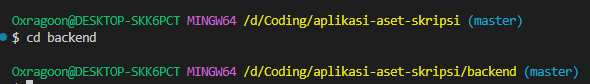
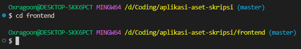

# Aplikasi Pengelolaan Inventaris Barang Berdasarkan Usia Pakai Berbasis Web

### Tech

Aplikasi ini dibangun menggunakan

- ### Frontend
- [Vite](https://vite.dev/)
- [Reactjs](https://react.dev/)
- [react-bootstrap](https://react-bootstrap.netlify.app/)
- [bootstrap](https://getbootstrap.com/)
- ### Backend
- [NodeJs](https://nodejs.org/id)
- [Expressjs](https://expressjs.com/)
- ### Database
- [Laragon](https://laragon.org/)
- MySQL

### Cara menjalankan

1. Install [NodeJs](https://nodejs.org/id)
2. Install `nodemon` secara global dengan cara ketik di terminal cmd
   ```
   npm install -g nodemon
   ```
3. Install [Laragon](https://laragon.org/)
4. Aktifkan `Laragon`
5. Buka terminal (`CMD`) atau (`GitBash`)
6. Masuk directory file code
   - 
   - Masuk ke `directory root` tempat folder backend dengan ketik
     ```
     cd backend
     ```
   - 
   - Ketik `npm install` untuk menginstall semua dependencies
   - Ketik `nodemon index` untuk menjalankan server
7. Masuk ke `directory root` tempat folder frontend dengan ketik
   ```
   cd frontend
   ```
   - 
   - Ketik `npm install` untuk menginstall semua dependencies
   - Ketik `npm run dev` untuk menjalankan vite client

# Credit

> Jayano Pihawiani | jayaphwn@gmail.com
