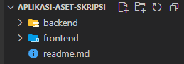

# Aplikasi Pengelolaan Inventaris Barang Berdasarkan Usia Pakai Berbasis Web

### Tech

Aplikasi ini dibangun menggunakan

- ### Frontend
- [Vite](https://vite.dev/)
- [Reactjs](https://react.dev/)
- [react-bootstrap](https://react-bootstrap.netlify.app/)
- [bootstrap](https://getbootstrap.com/)
- ### Backend
- [NodeJs](https://nodejs.org/id)
- [Expressjs](https://expressjs.com/)
- ### Database
- Laragon
- MySQL

### Cara menjalankan

- Buka terminal (`CMD`) atau (`GitBash`)
  - 
- Masuk ke `directory root` tempat folder backend
  - Contoh `C:\backend\`
  - Ketik `nodemon index` untuk menjalankan server
- Masuk ke `directory root` tempat folder frontend
  - Contoh `C:\frontend\`
  - Ketik `npm run dev` untuk menjalankan vite client

# Credit

> Jayano Pihawiani | jayaphwn@gmail.com
